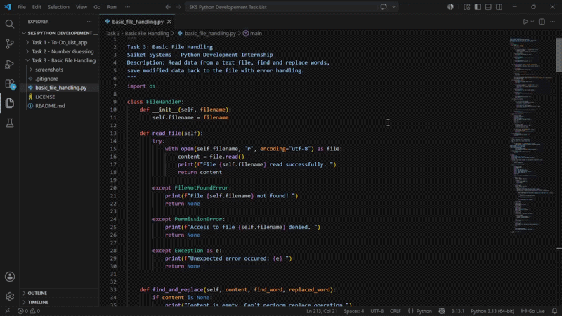

# Basic File Handling Application 📄

A Python CLI application for reading, modifying, and creating text files with robust error handling.
Built as **Task 3** for **Saiket Systems Python Development Internship**.

## 🎬 Live Demo



## 📸 Project Preview

### Main Menu


### Read File Operation


### Create Sample File


### Find & Replace Operation


### File Information


### Create Custom File


---

## ✨ Features

✅ **Read Files** - Display file content with error handling
✅ **Find & Replace** - Search and replace words in files
✅ **File Information** - View file size and properties
✅ **Create Sample Files** - Demo file with pre-written content
✅ **Create Custom Files** - Create files with your own content
✅ **Robust Error Handling** - FileNotFoundError, PermissionError, IOError
✅ **User-Friendly Menu** - Interactive CLI interface

---

## 💻 Technical Stack

- **Language:** Python 3.x
- **Concepts:**
  - File I/O operations
  - Exception handling (try-except)
  - String manipulation
  - Object-Oriented Programming
  - Input validation

---

## 🚀 How to Run

```bash
# Clone the repository
git clone https://github.com/khushirai2216-boop/Basic-File-Handling.git
cd Basic-File-Handling

# Run the application
python basic_file_handling.py
```

---

## 📖 How to Use

### **Option 1: Read File**
View any file's content with error handling

### **Option 2: Find & Replace**
Search for words and replace them in your file

### **Option 3: File Information**
Check file size in bytes and KB

### **Option 4: Create Sample File**
Generate a demo file with Python-related content for testing

### **Option 5: Create Custom File**
Create your own file with custom content (line by line, type 'END' to finish)

### **Option 6: Exit**
Close the application gracefully

---

## 🔑 Key Concepts Implemented

| Concept | Implementation |
|---------|-----------------|
| **File I/O** | `open()`, `read()`, `write()` with context managers |
| **Exception Handling** | FileNotFoundError, PermissionError, IOError, Exception |
| **String Methods** | `count()`, `replace()`, `strip()`, `upper()` |
| **OOP** | FileHandler class with multiple methods |
| **Input Validation** | Checks for empty content and missing files |
| **User Interaction** | Menu-driven interface with error messages |

---

## 📊 Code Structure
basic_file_handling.py

├── FileHandler (class)

│   ├── init(filename)

│   ├── read_file()

│   ├── find_and_replace(content, find_word, replaced_word)

│   ├── write_file(content)

│   └── display_file_info()

│

├── create_sample_file(filename)

├── create_custom_file(filename)

└── main()

---

## 🎓 Learning Outcomes

✅ File handling with Python (reading, writing, creating)
✅ Exception handling for different error scenarios
✅ String manipulation and text processing
✅ Object-Oriented Programming (classes and methods)
✅ Menu-driven application design
✅ Input validation and error management
✅ User experience design for CLI applications

---

## 💡 Future Enhancements

- [ ] Add file backup functionality
- [ ] Implement undo/redo operations
- [ ] Add search with case sensitivity options
- [ ] Support for multiple file formats (CSV, JSON, etc.)
- [ ] File encryption/decryption
- [ ] GUI version using tkinter
- [ ] Batch file operations
- [ ] File comparison tool

---

## 📄 License

This project is licensed under the MIT License - see the LICENSE file for details.

---

## 👨‍💼 About

Built as **Task 3** of **Saiket Systems Python Development Internship**

**Skills Demonstrated:**
- Python Programming
- File I/O Operations
- Error Handling & Debugging
- OOP Principles
- Problem Solving
- Code Documentation

---

## 🔗 Related Projects

- [Task 1: To-Do List Application](https://github.com/khushirai2216-boop/To-Do_List_app)
- [Task 2: Number Guessing Game](https://github.com/khushirai2216-boop/Number-Guessing-Game)

---

Built with ❤️ | [GitHub Profile](https://github.com/khushirai2216-boop)